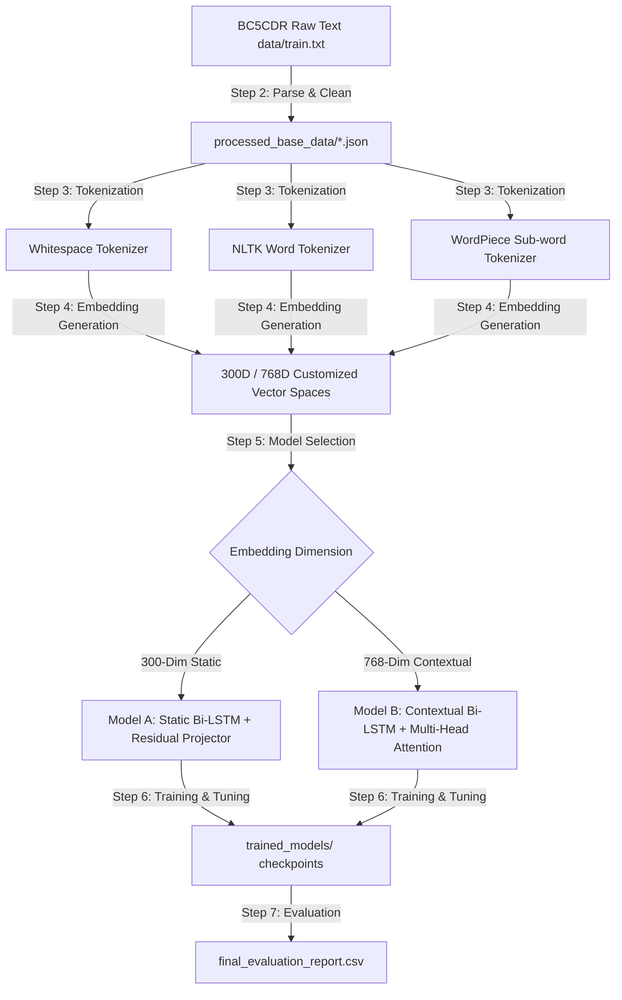

# Tokenization and Embedding Methods on a Named Entity Recognition (NER) Pipeline

An end-to-end Named Entity Recognition (NER) pipeline targeting clinical entity extraction (specifically **Disease** names) on the **BC5CDR BioCreative Corpus**. This project systematically evaluates the performance matrix of **3 Tokenization Strategies** and **5 Embedding Techniques** combined with custom-engineered **Bi-LSTM Sequence Classifiers** implemented in PyTorch.

---

## 📋 Table of Contents

1. [Project Overview](#-project-overview)
2. [System Architecture & Workflow](#-system-architecture--workflow)
3. [Repository Directory Structure](#-repository-directory-structure)
4. [Dataset & Data Processing (Steps 1 & 2)](#-dataset--data-processing-steps-1--2)
5. [Tokenization Profiles (Step 3)](#-tokenization-profiles-step-3)
6. [Embedding Pipelines & Training (Step 4)](#-embedding-pipelines--training-step-4)
7. [Sequence Modeling Architectures (Step 5)](#-sequence-modeling-architectures-step-5)
   - [Model A: Static Bi-LSTM Classifier (300D)](#model-a-static-bi-lstm-classifier-300d)
   - [Model B: Contextual Bi-LSTM & Multi-Head Attention Classifier (768D)](#model-b-contextual-bi-lstm--multi-head-attention-classifier-768d)
8. [Training Configurations & Tuning (Step 6)](#-training-configurations--tuning-step-6)
9. [Performance Benchmarks & Deep Analysis (Step 7)](#-performance-benchmarks--deep-analysis-step-7)
   - [Final Evaluation Results Table](#final-evaluation-results-table)
   - [Key Takeaways & Analytical Insights](#key-takeaways--analytical-insights)
10. [Getting Started & Usage](#-getting-started--usage)
11. [License](#-license)

---

## 🔍 Project Overview

The primary objective of this project is to perform a rigorous empirical analysis of different text preprocessing and representation combinations on clinical Named Entity Recognition. Named Entity Recognition in the biomedical domain is highly challenging due to complex entity morphology (e.g., compound chemical formulas, disease suffixes/prefixes like *hypotension*, *renal*, *carditis*) and out-of-vocabulary (OOV) challenges.

This codebase implements a unified framework to compare:
* **Tokenizers**: Whitespace Tokenization, NLTK Word Tokenization, and WordPiece Tokenization (sub-word).
* **Embeddings**: Custom-trained Word2Vec, Custom-trained FastText, Custom PyTorch-optimized GloVe SGD, Custom Domain-Pretrained ELMo, and Domain-Adapted Fine-tuned BERT.
* **Sequence Models**: PyTorch Bi-LSTM with residual skip connections (Model A for 300D static embeddings) and PyTorch Bi-LSTM with Multi-Head Self-Attention (Model B for 768D contextual embeddings).

All operations, evaluations, and visualizations are detailed inside the primary Jupyter notebook: [Tokenization_and_Embedding_Methods_on_an_NER_Pipeline.ipynb](file:///D:/My%20University/CSC4182%20Natural%20Language%20Processing/Programming%20Assignment%2001/Tokenization_and_Embedding_Methods_on_an_NER_Pipeline/Tokenization_and_Embedding_Methods_on_an_NER_Pipeline.ipynb).

---

## 🛠️ System Architecture & Workflow

The pipeline utilizes a linear processing layout, moving from raw datasets to formatted labels, tokenized artifacts, embedding generation, network modeling, training, and final evaluation.

### High-Level Workflow Diagram


### Detailed Sequence Classifier Layers
```mermaid
graph LR
    subgraph Model A: Static Bi-LSTM Architecture (300D Input)
        A1[300D Input Embeddings] --> A2[Spatial 1D Dropout]
        A2 --> A3[2-Layer Stacked Bi-LSTM]
        A1 --> A4[Residual Projection: Linear 300->H]
        A3 --> A5[Sum LSTM + Residual Trace]
        A4 --> A5
        A5 --> A6[Layer Normalization]
        A6 --> A7[Intermediate Dense: Linear H->H/2]
        A7 --> A8[Mish Activation & Dropout]
        A8 --> A9[Inference Head: Linear H/2->Tags]
    end
    
    subgraph Model B: Contextual Bi-LSTM + Attention (768D Input)
        B1[768D Input Embeddings] --> B2[Spatial 1D Dropout]
        B2 --> B3[3-Layer Stacked Bi-LSTM]
        B1 --> B4[Residual Projector: Linear 768->H]
        B4 --> B5[Scale Coefficient x0.1]
        B3 --> B6[Sum LSTM + Scaled Residual Trace]
        B5 --> B6
        B6 --> B7[Layer Norm LSTM]
        B7 --> B8[Multi-Head Self-Attention: 4 heads]
        B8 --> B9[Context Fusion: LSTM + Attention]
        B7 --> B9
        B9 --> B10[Layer Norm Attention]
        B10 --> B11[Intermediate Dense: Linear H->H/2]
        B11 --> B12[Mish Activation & Dropout]
        B12 --> B13[Inference Head: Linear H/2->Tags]
    end
```

---

## 📁 Repository Directory Structure

```directory
.
├── data/
│   ├── train.txt                           # Raw BC5CDR training split word-tag pairs
│   ├── val.txt                             # Raw BC5CDR validation split
│   └── test.txt                            # Raw BC5CDR test split
├── processed_base_data/
│   ├── train.json                          # JSON representation: list of word & label arrays
│   ├── val.json                            # JSON representation validation
│   └── test.json                           # JSON representation test
├── tokenized_data/
│   ├── nltk/
│   │   ├── train.pkl                       # NLTK tokenized train dataset split
│   │   ├── val.pkl
│   │   └── test.pkl
│   ├── whitespace/
│   │   ├── train.pkl                       # Whitespace tokenized split
│   │   ├── val.pkl
│   │   └── test.pkl
│   └── wordpiece/
│   │   ├── train.pkl                       # WordPiece tokenized split
│   │   ├── val.pkl
│   │   └── test.pkl
├── trained_embeddings/
│   ├── bert/                               # Fine-tuned domain-adapted BERT vectors (.model)
│   ├── elmo/                               # Custom pre-trained ELMo vectors
│   ├── fasttext/                           # Custom-trained FastText models
│   ├── glove/                              # PyTorch Custom SGD-trained GloVe models
│   └── word2vec/                           # Custom-trained Word2Vec models
├── trained_models/
│   ├── bert/                               # Saved model checkpoints for BERT models
│   ├── elmo/                               # Saved checkpoints for ELMo models
│   ├── fasttext/                           # Saved checkpoints for FastText models
│   ├── glove/                              # Saved checkpoints for GloVe models
│   ├── word2vec/                           # Saved checkpoints for Word2Vec models
│   └── final_evaluation_report.csv         # Consolidated performance benchmarks CSV file
├── trained_models_v2/
│   └── v2_master_tuning_report.csv         # Hyperparameter configurations list CSV
├── Tokenization_and_Embedding_Methods_on_an_NER_Pipeline.ipynb # Primary project notebook
├── Tokenization_and_Embedding_Methods_on_an_NER_Pipeline.pdf   # Exported pipeline document
└── README.md                               # Project documentation (this file)
```

---

## 📊 Dataset & Data Processing (Steps 1 & 2)

The project leverages the **BC5CDR disease named entity recognition dataset**. The raw text files consist of space-separated tokens with a single NER tag per line. The target tags are:
* `PAD` (Index 0): Structural padding.
* `O` (Index 1): Outside any disease entity.
* `B-Disease` (Index 2): Beginning of a disease named entity.
* `I-Disease` (Index 3): Inside/continuation of a disease named entity.

### Preprocessing Stage
The raw text in [train.txt](file:///D:/My%20University/CSC4182%20Natural%20Language%20Processing/Programming%20Assignment%2001/Tokenization_and_Embedding_Methods_on_an_NER_Pipeline/data/train.txt) is parsed to group tokens into continuous sentence sequences, validating length consistency between token lists and labels. The processed sentences are serialized as JSON records inside:
* [train.json](file:///D:/My%20University/CSC4182%20Natural%20Language%20Processing/Programming%20Assignment%2001/Tokenization_and_Embedding_Methods_on_an_NER_Pipeline/processed_base_data/train.json) (4,560 sentences)
* [val.json](file:///D:/My%20University/CSC4182%20Natural%20Language%20Processing/Programming%20Assignment%2001/Tokenization_and_Embedding_Methods_on_an_NER_Pipeline/processed_base_data/val.json) (4,581 sentences)
* [test.json](file:///D:/My%20University/CSC4182%20Natural%20Language%20Processing/Programming%20Assignment%2001/Tokenization_and_Embedding_Methods_on_an_NER_Pipeline/processed_base_data/test.json) (4,797 sentences)

---

## 🔤 Tokenization Profiles (Step 3)

We compare three tokenizers. For sub-word tokenization, labels are aligned by mapping the parent token's tag to all of its component sub-words.

| Tokenizer Type | Unique Vocab Size (Train) | Median Seq Length (Tokens) | Max Seq Length (Tokens) | Tag Alignment Strategy |
| :--- | :---: | :---: | :---: | :--- |
| **Whitespace** | 9,981 | 23 | 154 | Raw 1-to-1 Mapping |
| **NLTK Word** | 9,980 | 23 | 154 | Raw 1-to-1 Mapping |
| **WordPiece** | 6,830 | 32 | 239 | Propagates word-level labels to sub-word fragments |

---

## 💾 Embedding Pipelines & Training (Step 4)

We customized five different embedding generation strategies to output either 300D or 768D matrices tailored to each tokenizer vocabulary:

1. **Word2Vec (300D)**: Trained from scratch on local dataset splits via Gensim's `Word2Vec`. Formulated with Skip-gram (`sg=1`), context window size = 5, minimum frequency count = 1, trained across 15 epochs.
2. **FastText (300D)**: Trained from scratch on local datasets using character n-grams between 3 and 6 to handle morphology and Out-Of-Vocabulary (OOV) structures. Configured with Skip-gram, window = 5, min_count = 1, trained for 15 epochs.
3. **GloVe (300D)**: Custom-built GloVe engine in PyTorch. Generates a symmetrical global co-occurrence weight matrix ($X_{ij}$) with distance-decay weighting ($1/\text{distance}$). Optimizes loss using Adam ($lr=0.05$) via batch SGD (batch size 2048) on GPU over 15 epochs:
   $$J = \sum_{i,j=1}^{V} f(X_{ij}) (w_i^T \tilde{w}_j + b_i + \tilde{b}_j - \log X_{ij})^2$$
4. **ELMo (768D)**: Pre-trained an unsupervised domain-adapted bi-directional language model (`ELMoPreTrainedExtractor` consisting of a Character CNN Simulation, a 2-layer Bi-LSTM stack, and an LM linear inference head) on the training corpus for 5 epochs. Extracted the 768-dimensional sequential state representations.
5. **BERT (768D)**: Fine-tuned `BertForMaskedLM` on local dataset splits with a 15% random masking strategy for domain adaptation (5 epochs, AdamW $lr=5\times10^{-5}$, batch size 16). Averaged final hidden layer states of sub-words to extract 768D contextual embedding representations.

---

## 🧠 Sequence Modeling Architectures (Step 5)

The classification configurations utilize two custom PyTorch models optimized for static vs. contextual inputs.

### Model A: Static Bi-LSTM Classifier (300D)
Designed for Word2Vec, FastText, and GloVe vectors. Establishes a residual connection from the raw inputs to the LSTM outputs.

```python
class StaticBiLSTM_NER(nn.Module):
    def __init__(self, hidden_dim, tagset_size, dropout_rate=0.3):
        super(StaticBiLSTM_NER, self).__init__()
        self.input_dim = 300
        self.embedding_dropout = nn.Dropout1d(p=dropout_rate)
        
        # Residual Projector to match hidden_dim output size
        self.residual_projector = nn.Linear(self.input_dim, hidden_dim)
        
        # Stacked Sequence Encoder
        self.lstm = nn.LSTM(
            input_size=self.input_dim, 
            hidden_size=hidden_dim // 2, 
            num_layers=2, 
            bidirectional=True, 
            batch_first=True,
            dropout=dropout_rate if dropout_rate > 0 else 0
        )
        self.layer_norm = nn.LayerNorm(hidden_dim)
        self.intermediate_dense = nn.Linear(hidden_dim, hidden_dim // 2)
        self.activation = nn.Mish()
        self.output_dropout = nn.Dropout(p=dropout_rate)
        self.hidden2tag = nn.Linear(hidden_dim // 2, tagset_size)
        self._init_weights()
```

### Model B: Contextual Bi-LSTM & Multi-Head Attention Classifier (768D)
Designed for ELMo and BERT vectors. Adds a deeper LSTM encoder and a Multi-Head Self-Attention block.

```python
class ContextualBiLSTM_Attention_NER(nn.Module):
    def __init__(self, hidden_dim, tagset_size, dropout_rate=0.3):
        super(ContextualBiLSTM_Attention_NER, self).__init__()
        self.input_dim = 768
        self.hidden_dim = hidden_dim
        self.embedding_dropout = nn.Dropout1d(p=dropout_rate)
        self.residual_projector = nn.Linear(self.input_dim, hidden_dim)
        
        # Learnable Residual Scale to prevent gradient saturation
        self.residual_scale = nn.Parameter(torch.tensor(0.1))
        
        # Deeper Sequence Encoder
        self.lstm = nn.LSTM(
            input_size=self.input_dim, 
            hidden_size=hidden_dim // 2, 
            num_layers=3, 
            bidirectional=True, 
            batch_first=True,
            dropout=dropout_rate
        )
        
        # Multi-Head Attention
        self.num_heads = 4
        self.multihead_attention = nn.MultiheadAttention(embed_dim=hidden_dim, num_heads=self.num_heads, batch_first=True)
        self.attention_dropout = nn.Dropout(p=dropout_rate)
        self.layer_norm_lstm = nn.LayerNorm(hidden_dim)
        self.layer_norm_atten = nn.LayerNorm(hidden_dim)
        self.intermediate_dense = nn.Linear(hidden_dim, hidden_dim // 2)
        self.activation = nn.Mish()
        self.output_dropout = nn.Dropout(p=dropout_rate)
        self.hidden2tag = nn.Linear(hidden_dim // 2, tagset_size)
        self._init_weights()
```

---

## ⚙️ Training Configurations & Tuning (Step 6)

The hyperparameters used for training and resume steps across all 15 configurations are logged in [v2_master_tuning_report.csv](file:///D:/My%20University/CSC4182%20Natural%20Language%20Processing/Programming%20Assignment%2001/Tokenization_and_Embedding_Methods_on_an_NER_Pipeline/trained_models_v2/v2_master_tuning_report.csv):

* **Embedding Dropout**: 0.5 (Model A & B)
* **LSTM Encoder Dropout**: 0.5
* **Fully-Connected Feature Dropout**: 0.5
* **Parameter Initialization**: Xavier Uniform (`xavier_uniform`)
* **Initial Learning Rate**: 0.001 (Optimized via `AdamW` weight decay $1.0\times10^{-4}$)
* **Batch Size**: 32
* **Loss Criterion**: Cross-Entropy Loss (ignoring structural `PAD` index 0)
* **Execution Device**: CUDA GPU acceleration

---

## 📈 Performance Benchmarks & Deep Analysis (Step 7)

Following full validation evaluation runs across all 15 permutations, the detailed precision, recall, and tag-specific F1 metrics are saved in [final_evaluation_report.csv](file:///D:/My%20University/CSC4182%20Natural%20Language%20Processing/Programming%20Assignment%2001/Tokenization_and_Embedding_Methods_on_an_NER_Pipeline/trained_models/final_evaluation_report.csv):

### Final Evaluation Results Table

| Rank | Embedding Model | Tokenizer Type | Epochs | Test Precision | Test Recall | Global Macro F1 | Global Weighted F1 | B-Disease F1 | I-Disease F1 |
| :---: | :--- | :--- | :---: | :---: | :---: | :---: | :---: | :---: | :---: |
| 1 | **FASTTEXT** | **WORDPIECE** | 18 | **0.8571** | 0.8367 | **0.8466** | 0.9657 | 0.7406 | 0.8164 |
| 2 | **GLOVE** | **WORDPIECE** | 18 | 0.8549 | **0.8383** | 0.8463 | 0.9659 | 0.7384 | **0.8173** |
| 3 | **ELMO** | **WORDPIECE** | 25 | 0.8442 | 0.8041 | 0.8232 | 0.9603 | 0.7057 | 0.7836 |
| 4 | **FASTTEXT** | **WHITESPACE** | 10 | 0.8175 | 0.7643 | 0.7889 | 0.9699 | 0.7053 | 0.6747 |
| 5 | **FASTTEXT** | **NLTK** | 24 | 0.8214 | 0.7578 | 0.7872 | **0.9704** | 0.7225 | 0.6519 |
| 6 | **GLOVE** | **NLTK** | 20 | 0.8003 | 0.7646 | 0.7816 | 0.9694 | 0.7013 | 0.6566 |
| 7 | **GLOVE** | **WHITESPACE** | 18 | 0.7762 | 0.7606 | 0.7673 | 0.9671 | 0.6831 | 0.6332 |
| 8 | **ELMO** | **NLTK** | 18 | 0.7710 | 0.7405 | 0.7552 | 0.9644 | 0.6706 | 0.6112 |
| 9 | **ELMO** | **WHITESPACE** | 12 | 0.7777 | 0.7177 | 0.7450 | 0.9637 | 0.6532 | 0.5979 |
| 10 | **WORD2VEC** | **NLTK** | 15 | 0.7056 | 0.7322 | 0.7180 | 0.9552 | 0.5598 | 0.6160 |
| 11 | **WORD2VEC** | **WHITESPACE** | 17 | 0.6768 | 0.7325 | 0.7009 | 0.9501 | 0.5161 | 0.6122 |
| 12 | **WORD2VEC** | **WORDPIECE** | 35 | 0.6449 | 0.6194 | 0.6317 | 0.9650 | 0.7321 | 0.8119 |
| 13 | **BERT** | **WORDPIECE** | 27 | 0.6389 | 0.6191 | 0.6286 | 0.9620 | **0.7413** | 0.7926 |
| 14 | **BERT** | **WHITESPACE** | 12 | 0.5769 | 0.6034 | 0.5892 | 0.9621 | 0.7140 | 0.6645 |
| 15 | **BERT** | **NLTK** | 19 | 0.5395 | 0.6142 | 0.5721 | 0.9627 | 0.6893 | 0.6180 |

### Key Takeaways & Analytical Insights

1. **WordPiece Tokenizer Dominance**:
   Across almost all embeddings, the WordPiece sub-word tokenizer consistently yielded the highest F1 performance. By splitting unseen clinical words into sub-word prefixes and suffixes (e.g. `hypotension` $\rightarrow$ `hypo`, `##tension`), it minimizes Out-of-Vocabulary (OOV) limitations and enables the neural model to learn morphological patterns (e.g., matching `-itis` suffixes with disease concepts).
2. **Sub-word Static Embeddings (FastText) Lead**:
   `FASTTEXT + WORDPIECE` achieved the top rank (Macro F1 of **0.8466**). FastText's native character n-gram modeling combined with sub-word tokenization provides robust representations for clinical terms.
3. **Custom GloVe Performance**:
   `GLOVE + WORDPIECE` was the second-best model (Macro F1 of **0.8463**). Despite being a static embedding, training GloVe in PyTorch directly on WordPiece co-occurrences captured strong semantic associations.
4. **Contextual Bottleneck in Small Datasets**:
   While pre-trained BERT and ELMo models are highly expressive, domain pre-training/fine-tuning them on the local dataset (4,560 sentences) for 5 epochs can lead to over-fitting or sub-optimal embedding adaptation. Additionally, Model B's complex Multi-Head Attention architecture requires larger datasets to generalize well, whereas Model A's residual skip connections provide a simpler, highly efficient representation path.

---

## 🚀 Getting Started & Usage

### 📦 Prerequisites & Environment
Ensure you have Python 3.8+ installed along with PyTorch (CUDA recommended for training GloVe, ELMo, and BERT). Install dependencies using pip:
```bash
pip install torch torchvision torchaudio --index-url https://download.pytorch.org/whl/cu118
pip install gensim nltk transformers pandas numpy scikit-learn seaborn matplotlib tqdm
```

### 🏃 Running the Pipeline
Open the primary Jupyter notebook and execute cells sequentially:
```bash
jupyter notebook Tokenization_and_Embedding_Methods_on_an_NER_Pipeline.ipynb
```
The notebook automatically handles:
1. Parsing raw text dataset files into clean JSON structures.
2. Tokenizing the text using the three tokenizers.
3. Training/Adapting Word2Vec, FastText, GloVe, ELMo, and BERT vectors.
4. Initializing and training Model A and Model B configurations.
5. Saving evaluation results to `trained_models/final_evaluation_report.csv`.

---

## 📄 License
This project is developed for educational and academic research purposes as part of natural language processing coursework. All datasets belong to their respective creators.